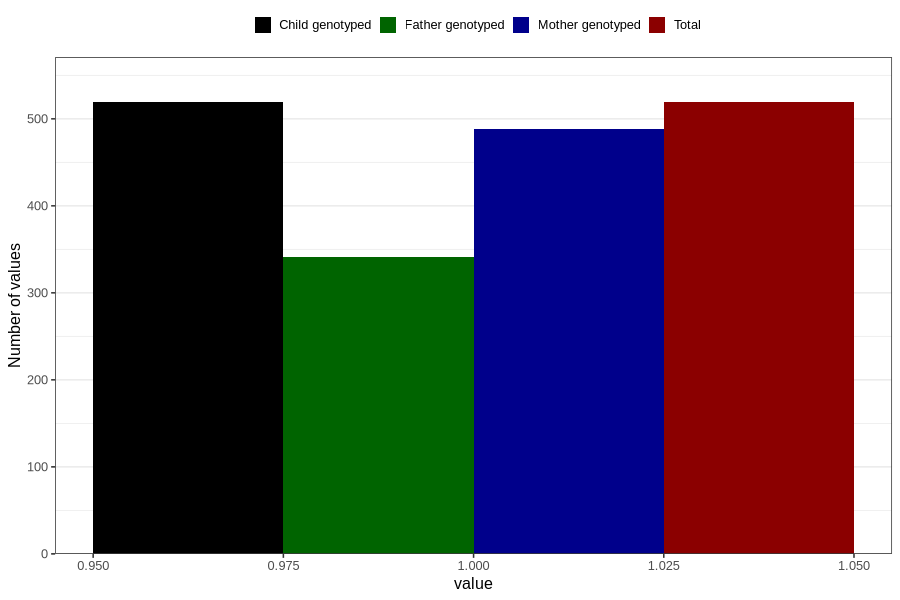

# vaginal_bleeding_2_17w_20w
Variable mapping to `CC325` in `Skjema3_v12`.
- Number of values:

| Value | Total | Child genotyped | Mother genotyped | Father genotyped |
| ----- | ----- | --------------- | ---------------- | ---------------- |
| Missing | 80287 | 80287 | 75536 | 52822 |
| Non-missing | 519 | 519 | 488 | 341 |
| 1 | 519 | 519 | 488 | 341 |

