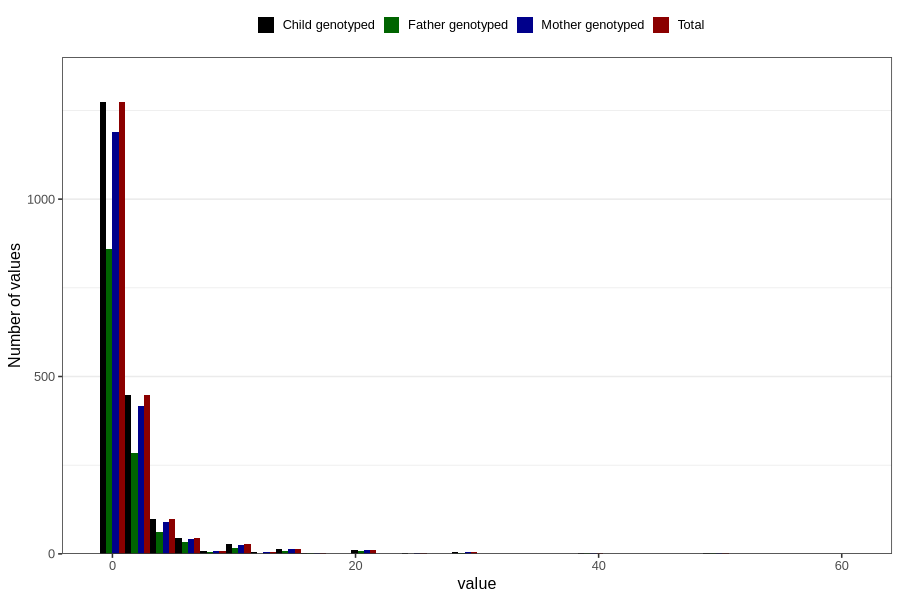

# vaginal_bleeding_2_duration
Variable mapping to `CC329` in `Skjema3_v12`.
- Number of values:

| Value | Total | Child genotyped | Mother genotyped | Father genotyped |
| ----- | ----- | --------------- | ---------------- | ---------------- |
| Missing | 78861 | 78861 | 74203 | 51874 |
| Non-missing | 1945 | 1945 | 1821 | 1289 |
| 25th percentile | 1 | 1 | 1 | 1 |
| 50th percentile | 1 | 1 | 1 | 1 |
| 75th percentile | 2 | 2 | 2 | 2 |
| Mean | 2.29820051413882 | 2.29820051413882 | 2.3272926963207 | 2.22342901474011 |
| Standard deviation | 4.20507260925109 | 4.20507260925109 | 4.30760467036495 | 3.94937415866758 |
| N | 1945 | 1945 | 1821 | 1289 |

