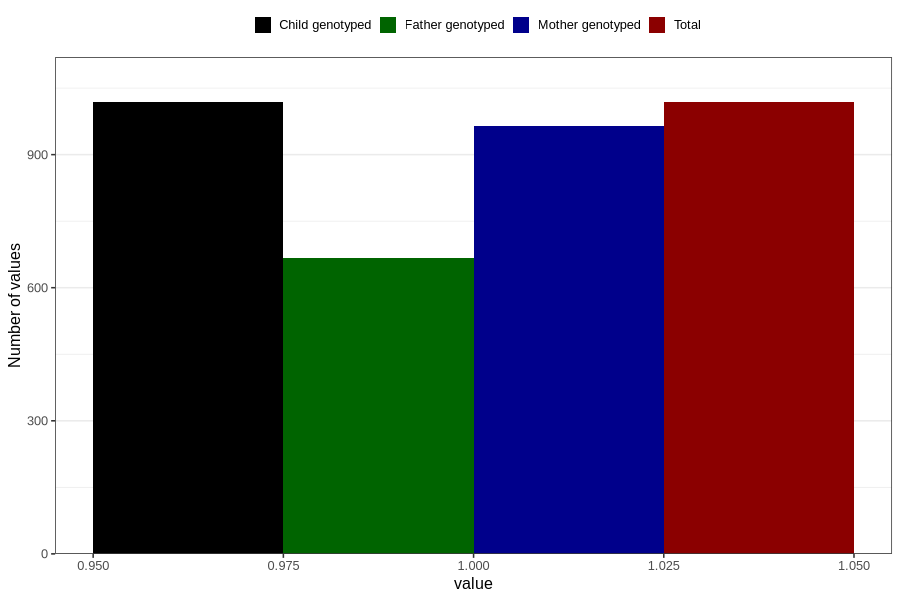

# vaginal_bleeding_know_why_other
Variable mapping to `CC338` in `Skjema3_v12`.
- Number of values:

| Value | Total | Child genotyped | Mother genotyped | Father genotyped |
| ----- | ----- | --------------- | ---------------- | ---------------- |
| Missing | 79788 | 79788 | 75060 | 52496 |
| Non-missing | 1018 | 1018 | 964 | 667 |
| 1 | 1018 | 1018 | 964 | 667 |

