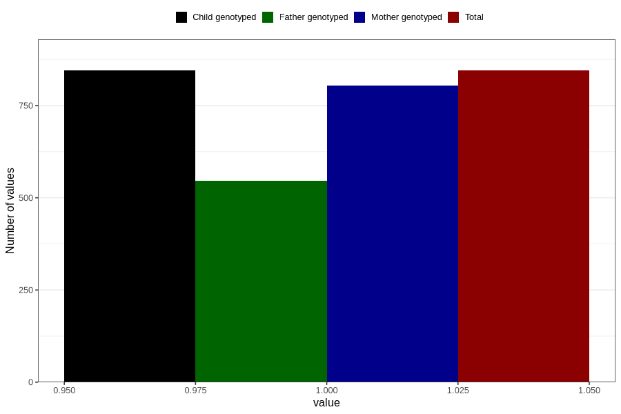

# vaginal_bleeding_know_why_placenta_position
Variable mapping to `CC333` in `Skjema3_v12`.
- Number of values:

| Value | Total | Child genotyped | Mother genotyped | Father genotyped |
| ----- | ----- | --------------- | ---------------- | ---------------- |
| Missing | 79961 | 79961 | 75220 | 52617 |
| Non-missing | 845 | 845 | 804 | 546 |
| 1 | 845 | 845 | 804 | 546 |

