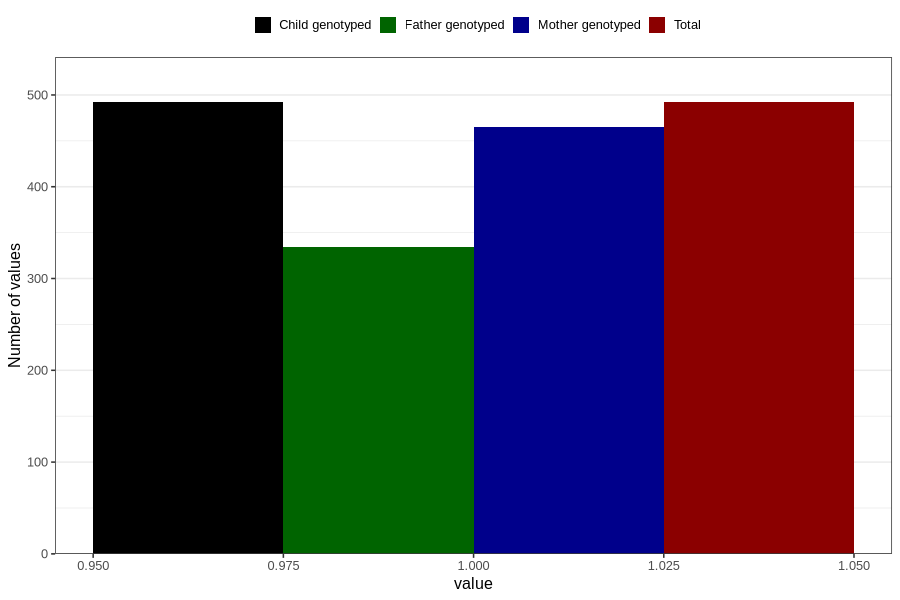

# vaginal_bleeding_more_than_two_episodes
Variable mapping to `CC330` in `Skjema3_v12`.
- Number of values:

| Value | Total | Child genotyped | Mother genotyped | Father genotyped |
| ----- | ----- | --------------- | ---------------- | ---------------- |
| Missing | 80314 | 80314 | 75559 | 52829 |
| Non-missing | 492 | 492 | 465 | 334 |
| 1 | 492 | 492 | 465 | 334 |

