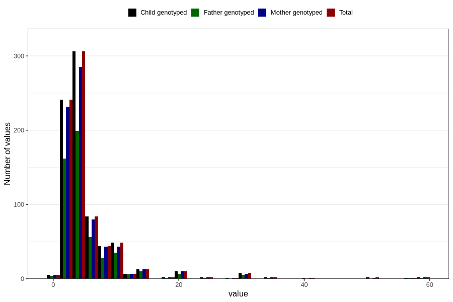

# vaginal_bleeding_more_than_two_episodes_n
Variable mapping to `CC331` in `Skjema3_v12`.
- Number of values:

| Value | Total | Child genotyped | Mother genotyped | Father genotyped |
| ----- | ----- | --------------- | ---------------- | ---------------- |
| Missing | 80026 | 80026 | 75288 | 52646 |
| Non-missing | 780 | 780 | 736 | 517 |
| 25th percentile | 3 | 3 | 3 | 3 |
| 50th percentile | 4 | 4 | 4 | 4 |
| 75th percentile | 6 | 6 | 6 | 6 |
| Mean | 5.96923076923077 | 5.96923076923077 | 5.92255434782609 | 5.79110251450677 |
| Standard deviation | 6.06990318673669 | 6.06990318673669 | 5.93898518528678 | 5.38362415603317 |
| N | 780 | 780 | 736 | 517 |

