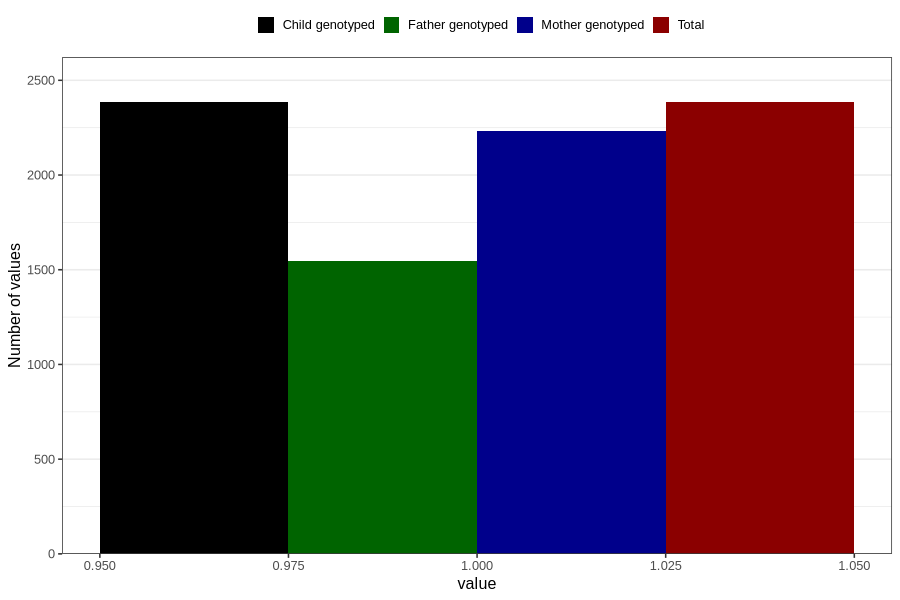

# vaginal_catarrh_unusual_discharge_13w_15w
Variable mapping to `AA249` in `Skjema1_v12`.
- Number of values:

| Value | Total | Child genotyped | Mother genotyped | Father genotyped |
| ----- | ----- | --------------- | ---------------- | ---------------- |
| Missing | 78422 | 78422 | 73789 | 51618 |
| Non-missing | 2384 | 2384 | 2235 | 1545 |
| 1 | 2384 | 2384 | 2235 | 1545 |

