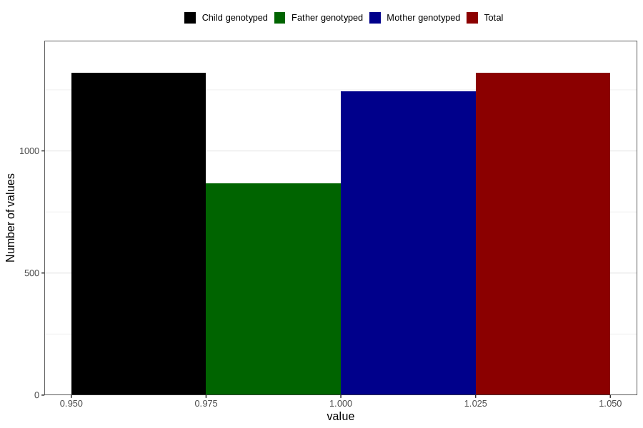

# vaginal_catarrh_unusual_discharge_17w_20w
Variable mapping to `CC413` in `Skjema3_v12`.
- Number of values:

| Value | Total | Child genotyped | Mother genotyped | Father genotyped |
| ----- | ----- | --------------- | ---------------- | ---------------- |
| Missing | 79487 | 79487 | 74779 | 52296 |
| Non-missing | 1319 | 1319 | 1245 | 867 |
| 1 | 1319 | 1319 | 1245 | 867 |

