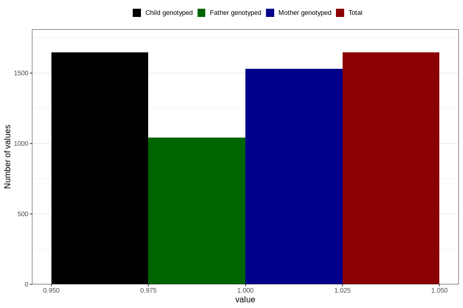

# vaginal_catarrh_unusual_discharge_5w_8w
Variable mapping to `AA247` in `Skjema1_v12`.
- Number of values:

| Value | Total | Child genotyped | Mother genotyped | Father genotyped |
| ----- | ----- | --------------- | ---------------- | ---------------- |
| Missing | 79160 | 79160 | 74493 | 52122 |
| Non-missing | 1646 | 1646 | 1531 | 1041 |
| 1 | 1646 | 1646 | 1531 | 1041 |

