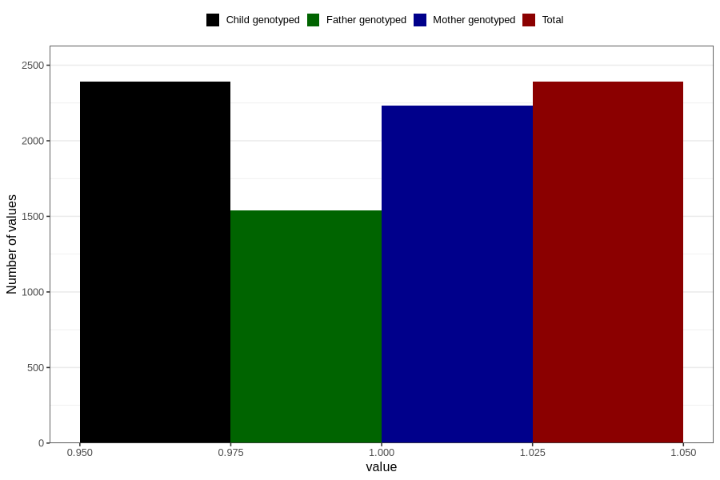

# vaginal_catarrh_unusual_discharge_9w_12w
Variable mapping to `AA248` in `Skjema1_v12`.
- Number of values:

| Value | Total | Child genotyped | Mother genotyped | Father genotyped |
| ----- | ----- | --------------- | ---------------- | ---------------- |
| Missing | 78416 | 78416 | 73790 | 51626 |
| Non-missing | 2390 | 2390 | 2234 | 1537 |
| 1 | 2390 | 2390 | 2234 | 1537 |

