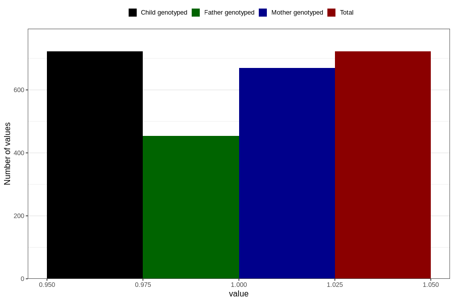

# vaginal_catarrh_unusual_discharge_before_4w
Variable mapping to `AA246` in `Skjema1_v12`.
- Number of values:

| Value | Total | Child genotyped | Mother genotyped | Father genotyped |
| ----- | ----- | --------------- | ---------------- | ---------------- |
| Missing | 80084 | 80084 | 75354 | 52709 |
| Non-missing | 722 | 722 | 670 | 454 |
| 1 | 722 | 722 | 670 | 454 |

