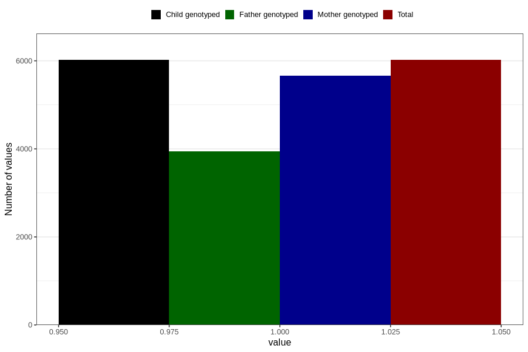

# vaginal_thrush_13w_15w
Variable mapping to `AA239` in `Skjema1_v12`.
- Number of values:

| Value | Total | Child genotyped | Mother genotyped | Father genotyped |
| ----- | ----- | --------------- | ---------------- | ---------------- |
| Missing | 74788 | 74788 | 70360 | 49218 |
| Non-missing | 6018 | 6018 | 5664 | 3945 |
| 1 | 6018 | 6018 | 5664 | 3945 |

