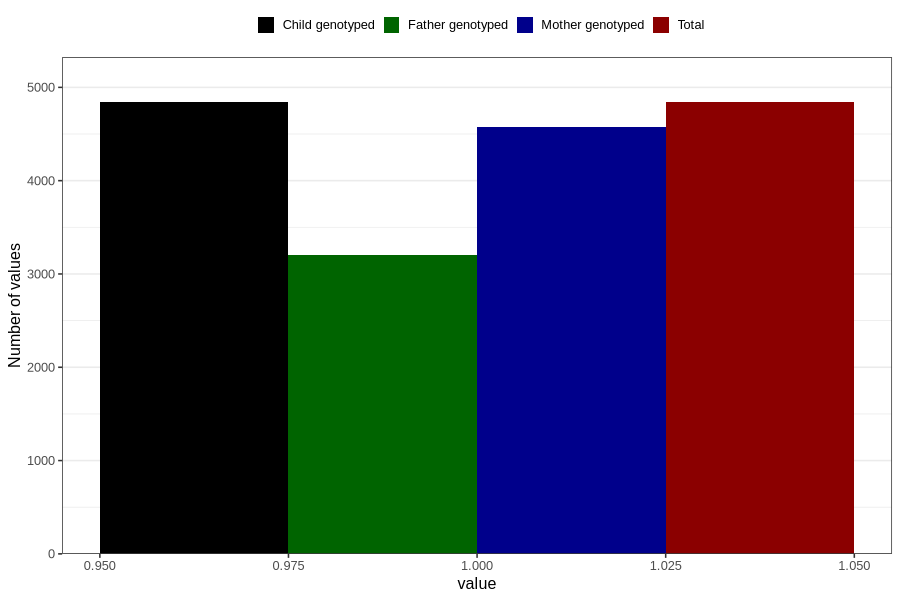

# vaginal_thrush_13w_16w
Variable mapping to `CC400` in `Skjema3_v12`.
- Number of values:

| Value | Total | Child genotyped | Mother genotyped | Father genotyped |
| ----- | ----- | --------------- | ---------------- | ---------------- |
| Missing | 75966 | 75966 | 71453 | 49965 |
| Non-missing | 4840 | 4840 | 4571 | 3198 |
| 1 | 4840 | 4840 | 4571 | 3198 |

