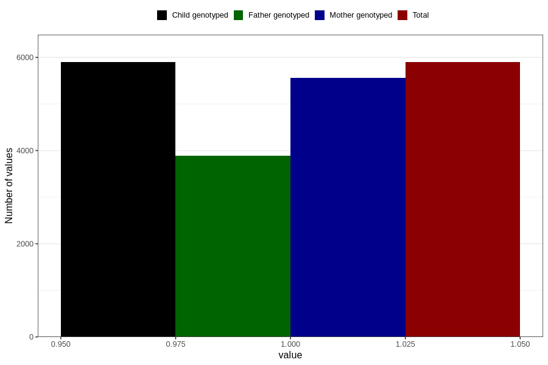

# vaginal_thrush_21w_24w
Variable mapping to `CC402` in `Skjema3_v12`.
- Number of values:

| Value | Total | Child genotyped | Mother genotyped | Father genotyped |
| ----- | ----- | --------------- | ---------------- | ---------------- |
| Missing | 74910 | 74910 | 70468 | 49269 |
| Non-missing | 5896 | 5896 | 5556 | 3894 |
| 1 | 5896 | 5896 | 5556 | 3894 |

