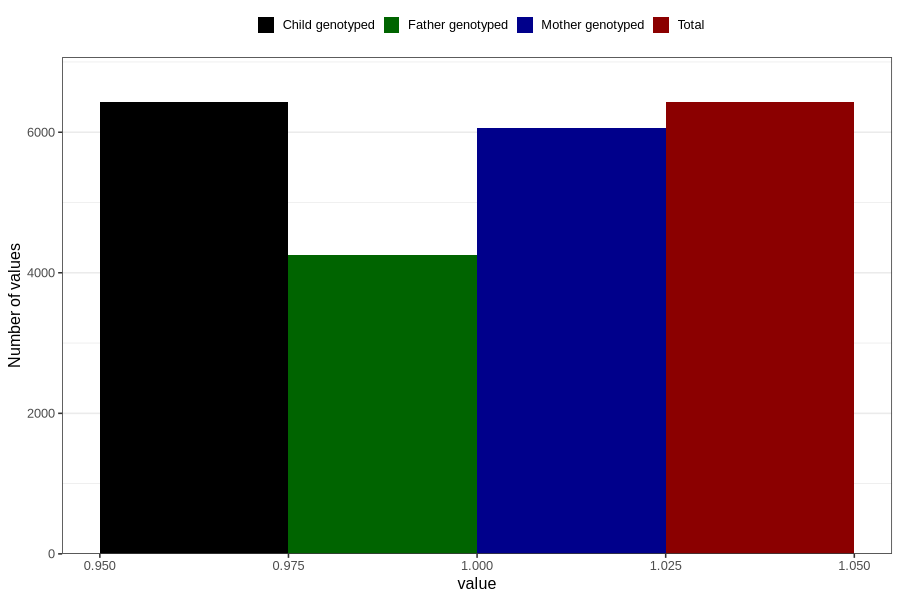

# vaginal_thrush_25w_28w
Variable mapping to `CC403` in `Skjema3_v12`.
- Number of values:

| Value | Total | Child genotyped | Mother genotyped | Father genotyped |
| ----- | ----- | --------------- | ---------------- | ---------------- |
| Missing | 74380 | 74380 | 69968 | 48904 |
| Non-missing | 6426 | 6426 | 6056 | 4259 |
| 1 | 6426 | 6426 | 6056 | 4259 |

