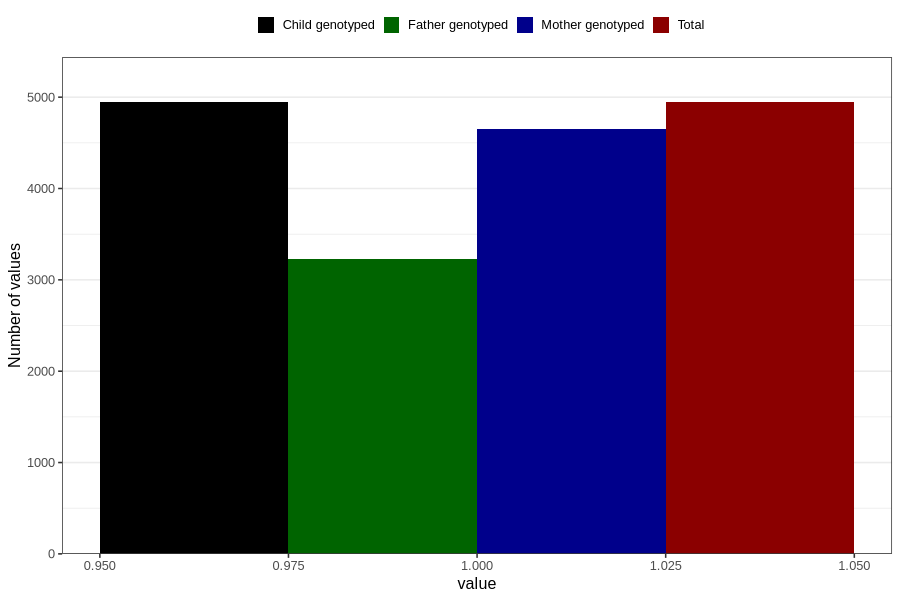

# vaginal_thrush_5w_8w
Variable mapping to `AA237` in `Skjema1_v12`.
- Number of values:

| Value | Total | Child genotyped | Mother genotyped | Father genotyped |
| ----- | ----- | --------------- | ---------------- | ---------------- |
| Missing | 75862 | 75862 | 71375 | 49936 |
| Non-missing | 4944 | 4944 | 4649 | 3227 |
| 1 | 4944 | 4944 | 4649 | 3227 |

