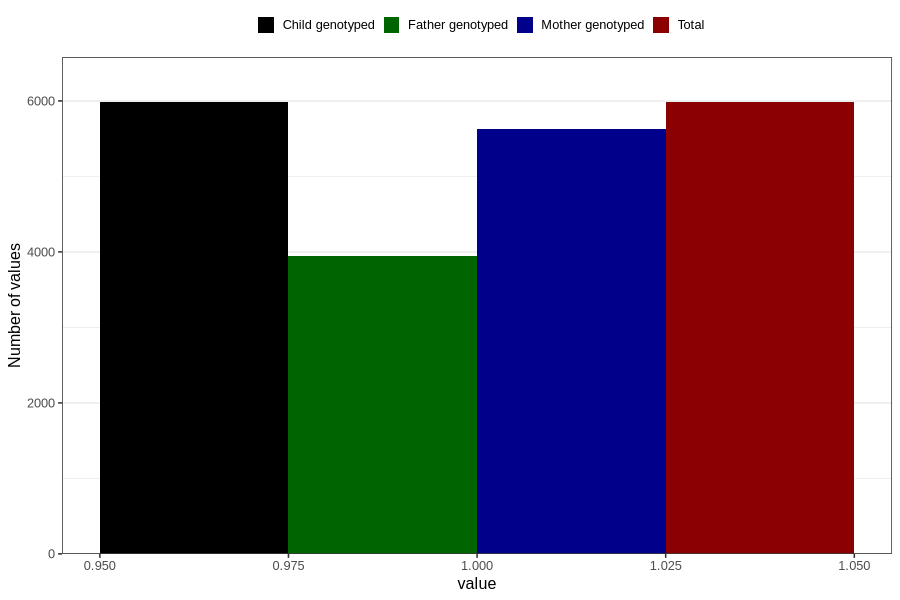

# vaginal_thrush_9w_12w
Variable mapping to `AA238` in `Skjema1_v12`.
- Number of values:

| Value | Total | Child genotyped | Mother genotyped | Father genotyped |
| ----- | ----- | --------------- | ---------------- | ---------------- |
| Missing | 74824 | 74824 | 70399 | 49213 |
| Non-missing | 5982 | 5982 | 5625 | 3950 |
| 1 | 5982 | 5982 | 5625 | 3950 |

