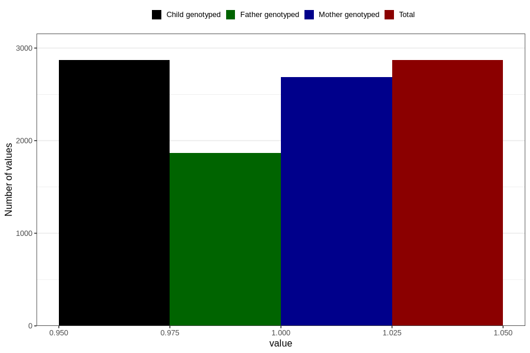

# vaginal_thrush_before_4w
Variable mapping to `AA236` in `Skjema1_v12`.
- Number of values:

| Value | Total | Child genotyped | Mother genotyped | Father genotyped |
| ----- | ----- | --------------- | ---------------- | ---------------- |
| Missing | 77937 | 77937 | 73336 | 51299 |
| Non-missing | 2869 | 2869 | 2688 | 1864 |
| 1 | 2869 | 2869 | 2688 | 1864 |

