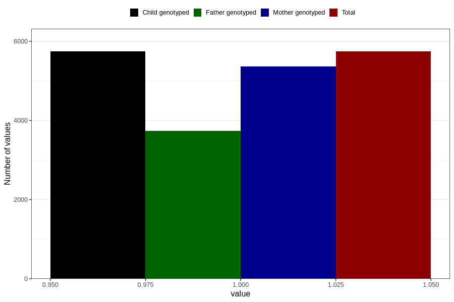

# vomiting_before_4w
Variable mapping to `AA226` in `Skjema1_v12`.
- Number of values:

| Value | Total | Child genotyped | Mother genotyped | Father genotyped |
| ----- | ----- | --------------- | ---------------- | ---------------- |
| Missing | 75065 | 75065 | 70658 | 49427 |
| Non-missing | 5741 | 5741 | 5366 | 3736 |
| 1 | 5741 | 5741 | 5366 | 3736 |

