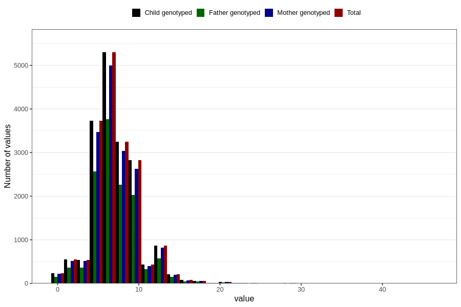

# vomiting_week_from_q2
Variable mapping to `BB857` in `Skjema2CDW_v12`.
- Number of values:

| Value | Total | Child genotyped | Mother genotyped | Father genotyped |
| ----- | ----- | --------------- | ---------------- | ---------------- |
| Missing | 62637 | 62637 | 59020 | 40469 |
| Non-missing | 18169 | 18169 | 17004 | 12694 |
| 25th percentile | 5 | 5 | 5 | 5 |
| 50th percentile | 7 | 7 | 7 | 7 |
| 75th percentile | 9 | 9 | 9 | 9 |
| Mean | 7.09664813693654 | 7.09664813693654 | 7.0970359915314 | 7.13187332598078 |
| Standard deviation | 3.04123906748294 | 3.04123906748294 | 3.04022214515261 | 2.98462728060323 |
| N | 18169 | 18169 | 17004 | 12694 |

