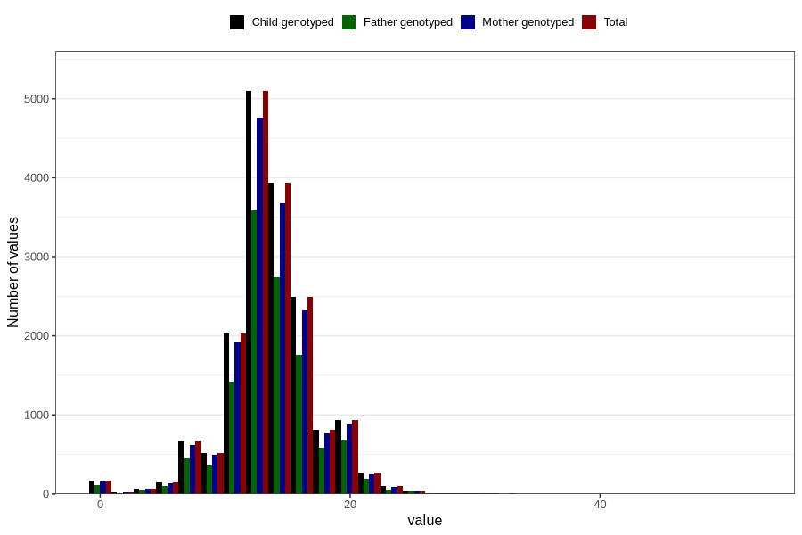

# vomiting_week_to_q2
Variable mapping to `BB858` in `Skjema2CDW_v12`.
- Number of values:

| Value | Total | Child genotyped | Mother genotyped | Father genotyped |
| ----- | ----- | --------------- | ---------------- | ---------------- |
| Missing | 63478 | 63478 | 59803 | 41022 |
| Non-missing | 17328 | 17328 | 16221 | 12141 |
| 25th percentile | 12 | 12 | 12 | 12 |
| 50th percentile | 13 | 13 | 13 | 13 |
| 75th percentile | 16 | 16 | 16 | 16 |
| Mean | 13.6001269621422 | 13.6001269621422 | 13.6000863078725 | 13.6361914175109 |
| Standard deviation | 3.64401283700036 | 3.64401283700036 | 3.64737934296193 | 3.60995851116303 |
| N | 17328 | 17328 | 16221 | 12141 |

