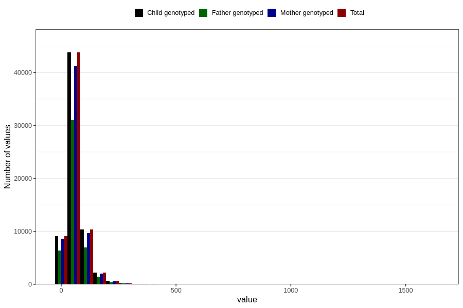

# added_sugar
Variable mapping to `SUKKER` in `Skjema2_beregning_CDW_v12`.
- Number of values:

| Value | Total | Child genotyped | Mother genotyped | Father genotyped |
| ----- | ----- | --------------- | ---------------- | ---------------- |
| Missing | 14283 | 14283 | 13548 | 6691 |
| Non-missing | 66523 | 66523 | 62476 | 46472 |
| 25th percentile | 36.16 | 36.16 | 36.12 | 35.97 |
| 50th percentile | 52.91 | 52.91 | 52.83 | 52.37 |
| 75th percentile | 76.83 | 76.83 | 76.73 | 75.65 |
| Mean | 63.0177225921862 | 63.0177225921862 | 62.8757113131443 | 61.8804400499225 |
| Standard deviation | 45.3118982134975 | 45.3118982134975 | 45.2058419842085 | 43.2456276524237 |
| N | 66523 | 66523 | 62476 | 46472 |

