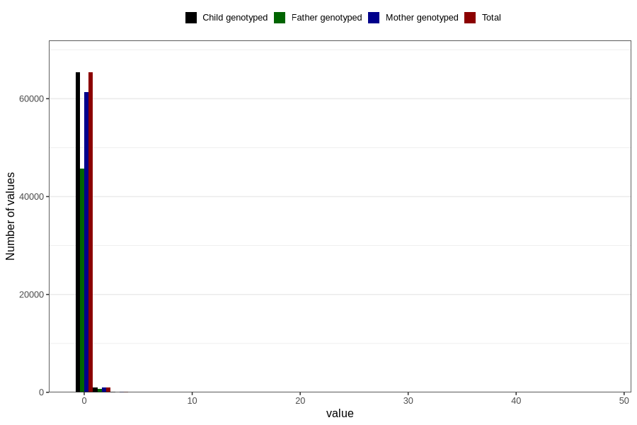

# alcohol
Variable mapping to `ALKOHOL` in `Skjema2_beregning_CDW_v12`.
- Number of values:

| Value | Total | Child genotyped | Mother genotyped | Father genotyped |
| ----- | ----- | --------------- | ---------------- | ---------------- |
| Missing | 14283 | 14283 | 13548 | 6691 |
| Non-missing | 66523 | 66523 | 62476 | 46472 |
| 25th percentile | 0 | 0 | 0 | 0 |
| 50th percentile | 0 | 0 | 0 | 0 |
| 75th percentile | 0 | 0 | 0 | 0 |
| Mean | 0.0756616508575981 | 0.0756616508575981 | 0.0754936295537486 | 0.0714875624031675 |
| Standard deviation | 0.499403603188169 | 0.499403603188169 | 0.504011205571433 | 0.436140028574781 |
| N | 66523 | 66523 | 62476 | 46472 |

