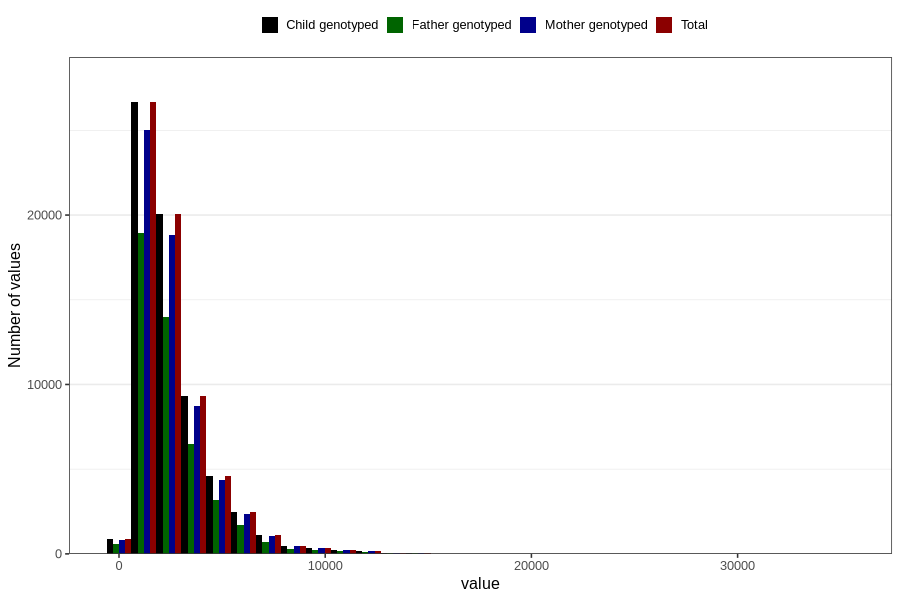

# beta_carotene
Variable mapping to `BETAKAROTEN` in `Skjema2_beregning_CDW_v12`.
- Number of values:

| Value | Total | Child genotyped | Mother genotyped | Father genotyped |
| ----- | ----- | --------------- | ---------------- | ---------------- |
| Missing | 14283 | 14283 | 13548 | 6691 |
| Non-missing | 66523 | 66523 | 62476 | 46472 |
| 25th percentile | 1452.94 | 1452.94 | 1453.085 | 1445.945 |
| 50th percentile | 2041.48 | 2041.48 | 2041.38 | 2023.985 |
| 75th percentile | 3233.715 | 3233.715 | 3233.9975 | 3202.75 |
| Mean | 2625.08575319814 | 2625.08575319814 | 2625.4023953198 | 2595.89995416595 |
| Standard deviation | 1860.3126021271 | 1860.3126021271 | 1857.88164308274 | 1829.25716947531 |
| N | 66523 | 66523 | 62476 | 46472 |

