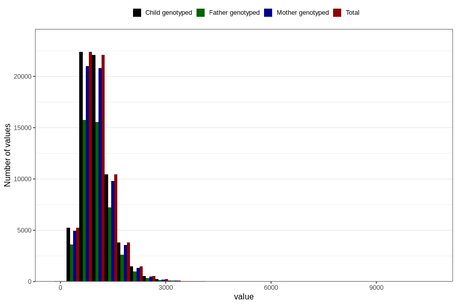

# calsium
Variable mapping to `KALSIUM` in `Skjema2_beregning_CDW_v12`.
- Number of values:

| Value | Total | Child genotyped | Mother genotyped | Father genotyped |
| ----- | ----- | --------------- | ---------------- | ---------------- |
| Missing | 14283 | 14283 | 13548 | 6691 |
| Non-missing | 66523 | 66523 | 62476 | 46472 |
| 25th percentile | 750.6 | 750.6 | 749.9 | 749.615 |
| 50th percentile | 976.37 | 976.37 | 976.265 | 973.695 |
| 75th percentile | 1265.58 | 1265.58 | 1264.2125 | 1258.3975 |
| Mean | 1056.0370592126 | 1056.0370592126 | 1054.71350150458 | 1049.45651768807 |
| Standard deviation | 472.936563459801 | 472.936563459801 | 471.457213933343 | 461.374544280335 |
| N | 66523 | 66523 | 62476 | 46472 |

