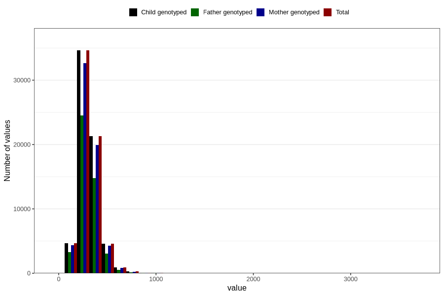

# carbohydrates
Variable mapping to `TOT_KARB` in `Skjema2_beregning_CDW_v12`.
- Number of values:

| Value | Total | Child genotyped | Mother genotyped | Father genotyped |
| ----- | ----- | --------------- | ---------------- | ---------------- |
| Missing | 14283 | 14283 | 13548 | 6691 |
| Non-missing | 66523 | 66523 | 62476 | 46472 |
| 25th percentile | 243.615 | 243.615 | 243.45 | 242.5575 |
| 50th percentile | 295.84 | 295.84 | 295.66 | 294.3 |
| 75th percentile | 358.98 | 358.98 | 358.6125 | 355.81 |
| Mean | 311.348402056432 | 311.348402056432 | 311.043059414815 | 308.585333534171 |
| Standard deviation | 108.540865053171 | 108.540865053171 | 107.998732718635 | 104.166858550562 |
| N | 66523 | 66523 | 62476 | 46472 |

