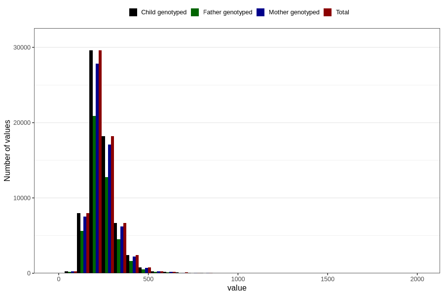

# cholesterol_mg
Variable mapping to `KOLESTEROL` in `Skjema2_beregning_CDW_v12`.
- Number of values:

| Value | Total | Child genotyped | Mother genotyped | Father genotyped |
| ----- | ----- | --------------- | ---------------- | ---------------- |
| Missing | 14283 | 14283 | 13548 | 6691 |
| Non-missing | 66523 | 66523 | 62476 | 46472 |
| 25th percentile | 192.67 | 192.67 | 192.56 | 192.2075 |
| 50th percentile | 228.86 | 228.86 | 228.8 | 227.81 |
| 75th percentile | 278.76 | 278.76 | 278.4525 | 276.89 |
| Mean | 244.220483291493 | 244.220483291493 | 244.046221909213 | 242.547183250129 |
| Standard deviation | 80.4727770810377 | 80.4727770810377 | 80.2277602175364 | 78.1494449659765 |
| N | 66523 | 66523 | 62476 | 46472 |

