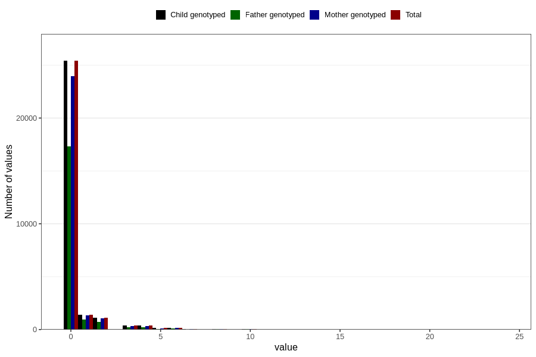

# coffee_before_boiled
Variable mapping to `AA1383` in `Skjema1_v12`.
- Number of values:

| Value | Total | Child genotyped | Mother genotyped | Father genotyped |
| ----- | ----- | --------------- | ---------------- | ---------------- |
| Missing | 51687 | 51687 | 48574 | 33455 |
| Non-missing | 29119 | 29119 | 27450 | 19708 |
| Consumption have been reported by a mark but no amount given | 1 | 1 | 1 |0 |
| 0 | 25407 | 25407 | 23967 | 17302 |
| 1 | 1413 | 1413 | 1332 | 930 |
| 2 | 1096 | 1096 | 1034 | 742 |
| 3 | 372 | 372 | 355 | 235 |
| 4 | 377 | 377 | 347 | 236 |
| 5 | 136 | 136 | 123 | 75 |
| 6 | 153 | 153 | 139 | 101 |
| 7 | 28 | 28 | 28 | 17 |
| 8 | 44 | 44 | 39 | 23 |
| 9 | 2 | 2 | 2 | 1 |
| 10 | 62 | 62 | 58 | 30 |
| 12 | 17 | 17 | 15 | 11 |
| 14 | 2 | 2 | 1 | 0 |
| 15 | 3 | 3 | 3 | 1 |
| 16 | 1 | 1 | 1 | 1 |
| 20 | 4 | 4 | 4 | 2 |
| 24 | 1 | 1 | 1 | 1 |

