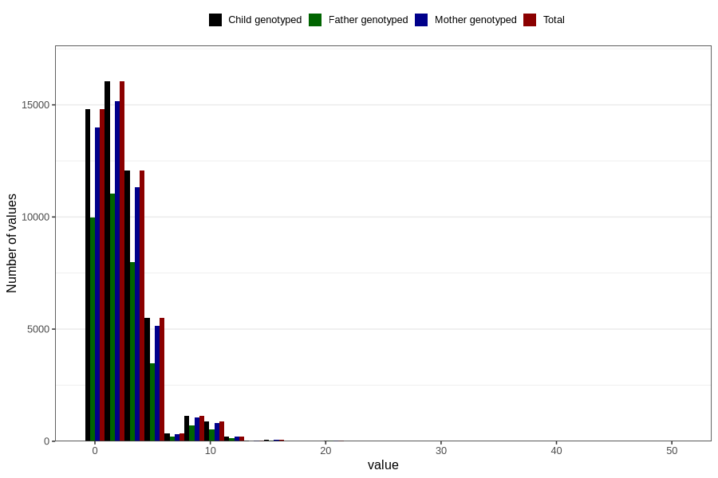

# coffee_before_filter
Variable mapping to `AA1377` in `Skjema1_v12`.
- Number of values:

| Value | Total | Child genotyped | Mother genotyped | Father genotyped |
| ----- | ----- | --------------- | ---------------- | ---------------- |
| Missing | 29676 | 29676 | 27832 | 18976 |
| Non-missing | 51130 | 51130 | 48192 | 34187 |
| Consumption have been reported by a mark but no amount given | 2 | 2 | 2 |1 |
| 25th percentile | 0 | 0 | 0 | 0 |
| 50th percentile | 2 | 2 | 2 | 2 |
| 75th percentile | 4 | 4 | 4 | 4 |
| Mean | 2.434204349867 | 2.434204349867 | 2.42477692467317 | 2.36731410518926 |
| Standard deviation | 2.51205423531687 | 2.51205423531687 | 2.50681205331587 | 2.4456809831101 |
| N | 51128 | 51128 | 48190 | 34186 |

