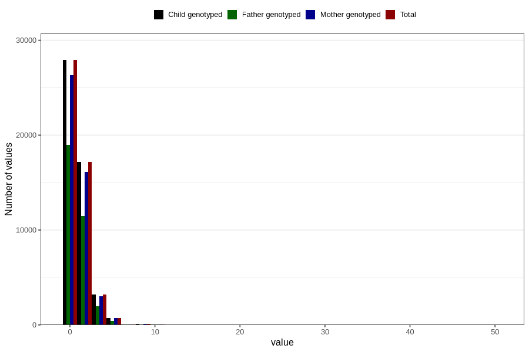

# coffee_during_filter
Variable mapping to `AA1378` in `Skjema1_v12`.
- Number of values:

| Value | Total | Child genotyped | Mother genotyped | Father genotyped |
| ----- | ----- | --------------- | ---------------- | ---------------- |
| Missing | 31472 | 31472 | 29548 | 20208 |
| Non-missing | 49334 | 49334 | 46476 | 32955 |
| 0 | 27916 | 27916 | 26354 | 18969 |
| 1 | 10397 | 10397 | 9807 | 7088 |
| 2 | 6778 | 6778 | 6338 | 4390 |
| 3 | 1833 | 1833 | 1700 | 1084 |
| 4 | 1401 | 1401 | 1327 | 880 |
| 5 | 419 | 419 | 394 | 241 |
| 6 | 340 | 340 | 319 | 175 |
| 7 | 37 | 37 | 36 | 24 |
| 8 | 103 | 103 | 98 | 56 |
| 9 | 5 | 5 | 4 | 2 |
| 10 | 73 | 73 | 69 | 33 |
| 12 | 20 | 20 | 19 | 7 |
| 14 | 1 | 1 | 1 | 1 |
| 15 | 1 | 1 | 1 | 1 |
| 16 | 2 | 2 | 1 | 0 |
| 20 | 6 | 6 | 6 | 3 |
| 25 | 1 | 1 | 1 | 1 |
| 50 | 1 | 1 | 1 | 0 |

