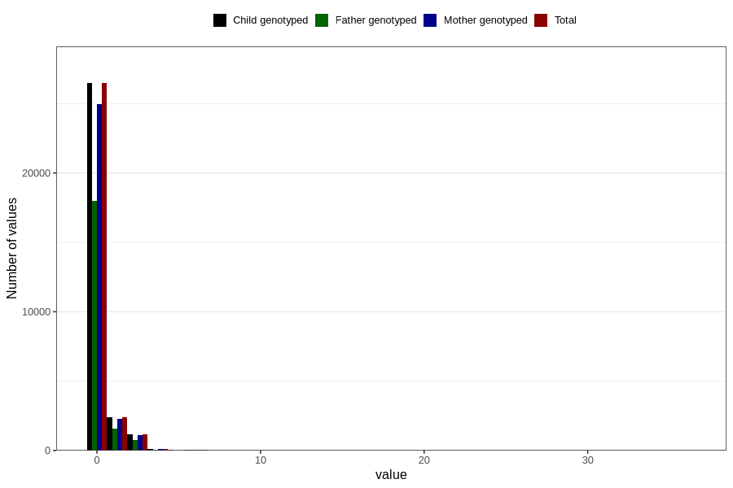

# coffee_during_instant
Variable mapping to `AA1381` in `Skjema1_v12`.
- Number of values:

| Value | Total | Child genotyped | Mother genotyped | Father genotyped |
| ----- | ----- | --------------- | ---------------- | ---------------- |
| Missing | 50532 | 50532 | 47491 | 32704 |
| Non-missing | 30274 | 30274 | 28533 | 20459 |
| 0 | 26472 | 26472 | 24949 | 17980 |
| 1 | 2410 | 2410 | 2277 | 1594 |
| 2 | 1018 | 1018 | 951 | 658 |
| 3 | 144 | 144 | 139 | 88 |
| 4 | 135 | 135 | 128 | 80 |
| 5 | 24 | 24 | 21 | 18 |
| 6 | 46 | 46 | 44 | 28 |
| 7 | 6 | 6 | 6 | 4 |
| 8 | 8 | 8 | 8 | 4 |
| 10 | 8 | 8 | 7 | 4 |
| 14 | 1 | 1 | 1 | 1 |
| 24 | 1 | 1 | 1 | 0 |
| 36 | 1 | 1 | 1 | 0 |

