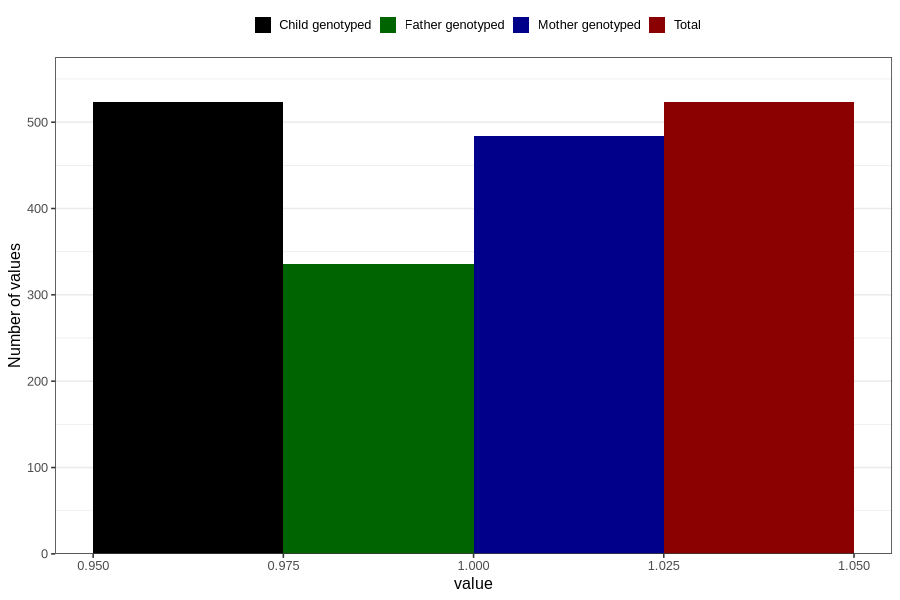

# coffee_filter_decaf
Variable mapping to `AA1379` in `Skjema1_v12`.
- Number of values:

| Value | Total | Child genotyped | Mother genotyped | Father genotyped |
| ----- | ----- | --------------- | ---------------- | ---------------- |
| Missing | 80283 | 80283 | 75540 | 52827 |
| Non-missing | 523 | 523 | 484 | 336 |
| 1 | 523 | 523 | 484 | 336 |

