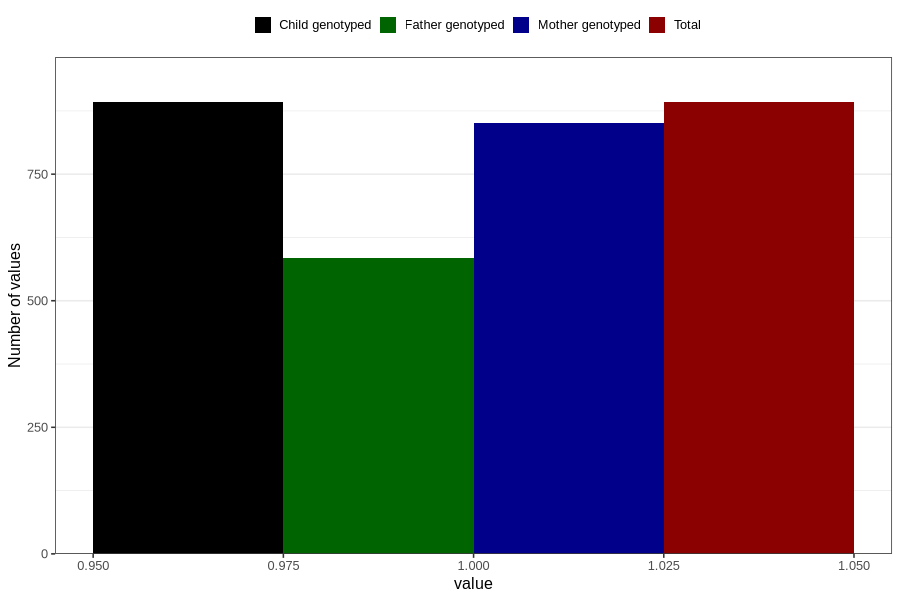

# coffee_instant_decaf
Variable mapping to `AA1382` in `Skjema1_v12`.
- Number of values:

| Value | Total | Child genotyped | Mother genotyped | Father genotyped |
| ----- | ----- | --------------- | ---------------- | ---------------- |
| Missing | 79914 | 79914 | 75172 | 52578 |
| Non-missing | 892 | 892 | 852 | 585 |
| 1 | 892 | 892 | 852 | 585 |

