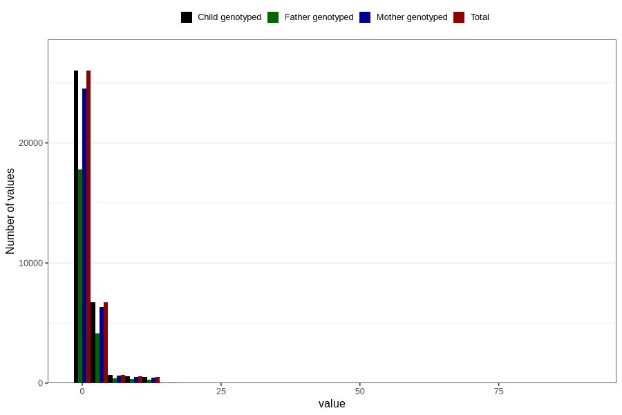

# coke_before
Variable mapping to `AA1392` in `Skjema1_v12`.
- Number of values:

| Value | Total | Child genotyped | Mother genotyped | Father genotyped |
| ----- | ----- | --------------- | ---------------- | ---------------- |
| Missing | 46293 | 46293 | 43550 | 30151 |
| Non-missing | 34513 | 34513 | 32474 | 23012 |
| Consumption have been reported by a mark but no amount given | 5 | 5 | 5 |2 |
| 25th percentile | 0 | 0 | 0 | 0 |
| 50th percentile | 0 | 0 | 0 | 0 |
| 75th percentile | 1 | 1 | 1 | 1 |
| Mean | 1.19146284919439 | 1.19146284919439 | 1.18260494625643 | 1.10512820512821 |
| Standard deviation | 2.33549686322853 | 2.33549686322853 | 2.32558612959746 | 2.28339725680174 |
| N | 34508 | 34508 | 32469 | 23010 |

