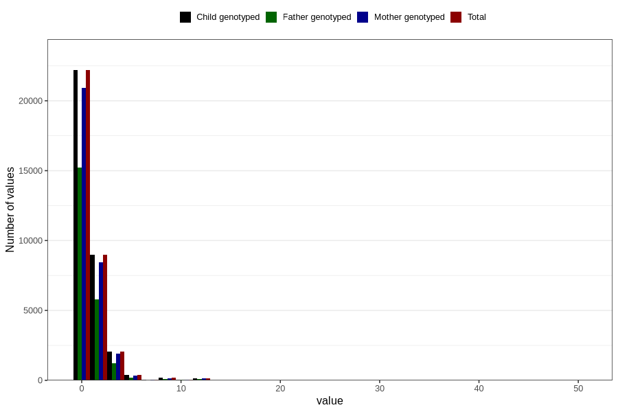

# coke_during
Variable mapping to `AA1393` in `Skjema1_v12`.
- Number of values:

| Value | Total | Child genotyped | Mother genotyped | Father genotyped |
| ----- | ----- | --------------- | ---------------- | ---------------- |
| Missing | 46820 | 46820 | 44002 | 30460 |
| Non-missing | 33986 | 33986 | 32022 | 22703 |
| Consumption have been reported by a mark but no amount given | 3 | 3 | 3 |1 |
| 25th percentile | 0 | 0 | 0 | 0 |
| 50th percentile | 0 | 0 | 0 | 0 |
| 75th percentile | 1 | 1 | 1 | 1 |
| Mean | 0.762587175940912 | 0.762587175940912 | 0.758268528061463 | 0.703021760197339 |
| Standard deviation | 1.64341079786559 | 1.64341079786559 | 1.63848896450389 | 1.59032376358433 |
| N | 33983 | 33983 | 32019 | 22702 |

