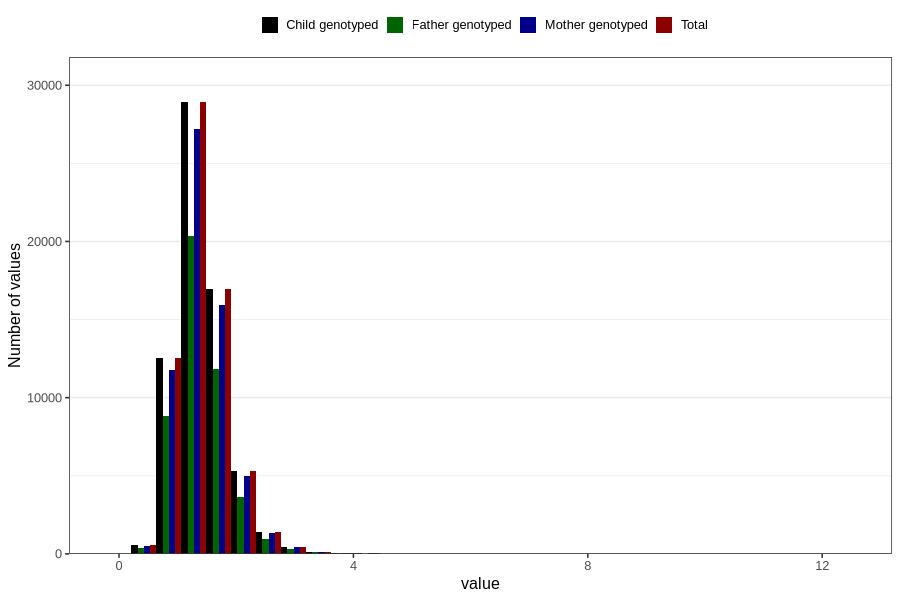

# copper
Variable mapping to `KOPPER` in `Skjema2_beregning_CDW_v12`.
- Number of values:

| Value | Total | Child genotyped | Mother genotyped | Father genotyped |
| ----- | ----- | --------------- | ---------------- | ---------------- |
| Missing | 14283 | 14283 | 13548 | 6691 |
| Non-missing | 66523 | 66523 | 62476 | 46472 |
| 25th percentile | 1.12 | 1.12 | 1.12 | 1.12 |
| 50th percentile | 1.35 | 1.35 | 1.35 | 1.35 |
| 75th percentile | 1.63 | 1.63 | 1.63 | 1.62 |
| Mean | 1.41582054327075 | 1.41582054327075 | 1.41516294256995 | 1.40815480289206 |
| Standard deviation | 0.460677800031206 | 0.460677800031206 | 0.459341582850724 | 0.446491776866697 |
| N | 66523 | 66523 | 62476 | 46472 |

