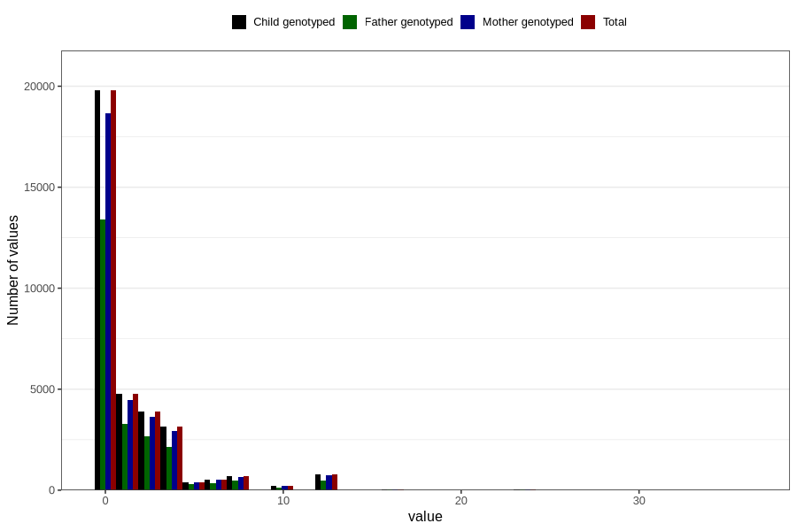

# diet_coke_before
Variable mapping to `AA1398` in `Skjema1_v12`.
- Number of values:

| Value | Total | Child genotyped | Mother genotyped | Father genotyped |
| ----- | ----- | --------------- | ---------------- | ---------------- |
| Missing | 46480 | 46480 | 43708 | 29888 |
| Non-missing | 34326 | 34326 | 32316 | 23275 |
| Consumption have been reported by a mark but no amount given | 4 | 4 | 3 |2 |
| 25th percentile | 0 | 0 | 0 | 0 |
| 50th percentile | 0 | 0 | 0 | 0 |
| 75th percentile | 2 | 2 | 2 | 2 |
| Mean | 1.47759454577239 | 1.47759454577239 | 1.47819762943707 | 1.4466978902591 |
| Standard deviation | 2.77222732059559 | 2.77222732059559 | 2.7720446536729 | 2.68492833847499 |
| N | 34322 | 34322 | 32313 | 23273 |

