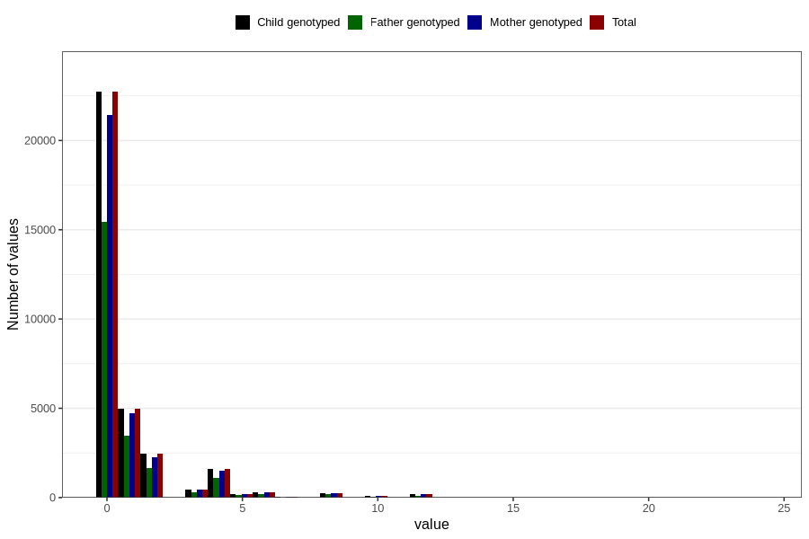

# diet_coke_during
Variable mapping to `AA1399` in `Skjema1_v12`.
- Number of values:

| Value | Total | Child genotyped | Mother genotyped | Father genotyped |
| ----- | ----- | --------------- | ---------------- | ---------------- |
| Missing | 47452 | 47452 | 44634 | 30526 |
| Non-missing | 33354 | 33354 | 31390 | 22637 |
| Consumption have been reported by a mark but no amount given | 3 | 3 | 2 |1 |
| 25th percentile | 0 | 0 | 0 | 0 |
| 50th percentile | 0 | 0 | 0 | 0 |
| 75th percentile | 1 | 1 | 1 | 1 |
| Mean | 0.807142214626248 | 0.807142214626248 | 0.803905951318975 | 0.783265594628026 |
| Standard deviation | 1.81557098807177 | 1.81557098807177 | 1.81046719891049 | 1.74685429674344 |
| N | 33351 | 33351 | 31388 | 22636 |

