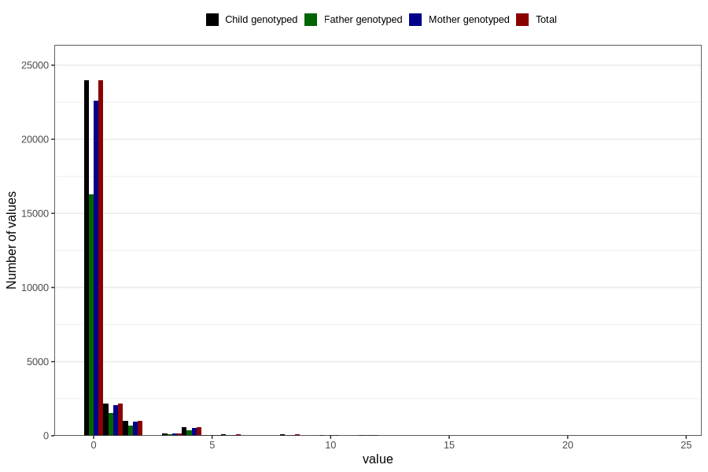

# diet_soda_during
Variable mapping to `AA1402` in `Skjema1_v12`.
- Number of values:

| Value | Total | Child genotyped | Mother genotyped | Father genotyped |
| ----- | ----- | --------------- | ---------------- | ---------------- |
| Missing | 52612 | 52612 | 49463 | 33984 |
| Non-missing | 28194 | 28194 | 26561 | 19179 |
| Consumption have been reported by a mark but no amount given | 2 | 2 | 2 |1 |
| 0 | 23968 | 23968 | 22584 | 16312 |
| 1 | 2182 | 2182 | 2062 | 1508 |
| 2 | 987 | 987 | 932 | 679 |
| 3 | 151 | 151 | 140 | 102 |
| 4 | 576 | 576 | 539 | 362 |
| 5 | 60 | 60 | 53 | 33 |
| 6 | 74 | 74 | 70 | 58 |
| 7 | 11 | 11 | 10 | 9 |
| 8 | 73 | 73 | 69 | 51 |
| 9 | 3 | 3 | 3 | 1 |
| 10 | 29 | 29 | 26 | 12 |
| 12 | 71 | 71 | 65 | 45 |
| 16 | 4 | 4 | 3 | 3 |
| 18 | 1 | 1 | 1 | 1 |
| 20 | 1 | 1 | 1 | 1 |
| 24 | 1 | 1 | 1 | 1 |

