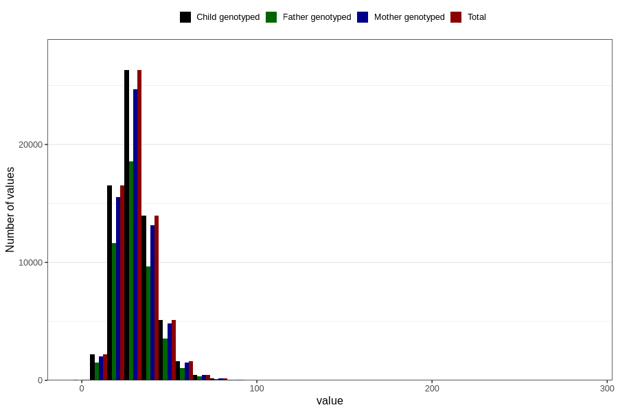

# dietary_fiber
Variable mapping to `FIBER` in `Skjema2_beregning_CDW_v12`.
- Number of values:

| Value | Total | Child genotyped | Mother genotyped | Father genotyped |
| ----- | ----- | --------------- | ---------------- | ---------------- |
| Missing | 14283 | 14283 | 13548 | 6691 |
| Non-missing | 66523 | 66523 | 62476 | 46472 |
| 25th percentile | 23.62 | 23.62 | 23.62 | 23.6 |
| 50th percentile | 29.5 | 29.5 | 29.49 | 29.39 |
| 75th percentile | 36.65 | 36.65 | 36.64 | 36.45 |
| Mean | 31.0769055815282 | 31.0769055815282 | 31.069179684999 | 30.9198693837149 |
| Standard deviation | 11.3564291854725 | 11.3564291854725 | 11.3268129605145 | 11.0851022947937 |
| N | 66523 | 66523 | 62476 | 46472 |

