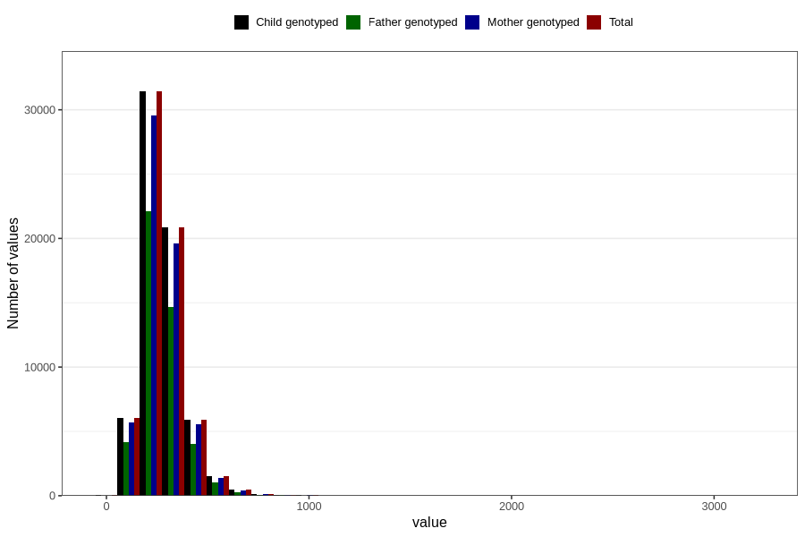

# folate
Variable mapping to `FOLAT` in `Skjema2_beregning_CDW_v12`.
- Number of values:

| Value | Total | Child genotyped | Mother genotyped | Father genotyped |
| ----- | ----- | --------------- | ---------------- | ---------------- |
| Missing | 14283 | 14283 | 13548 | 6691 |
| Non-missing | 66523 | 66523 | 62476 | 46472 |
| 25th percentile | 208.2 | 208.2 | 208.24 | 208.13 |
| 50th percentile | 261.21 | 261.21 | 261.105 | 260.725 |
| 75th percentile | 326.34 | 326.34 | 325.94 | 325.4825 |
| Mean | 277.988307352344 | 277.988307352344 | 277.724702125616 | 276.678714064383 |
| Standard deviation | 108.132081086056 | 108.132081086056 | 107.4092380971 | 104.672894356003 |
| N | 66523 | 66523 | 62476 | 46472 |

