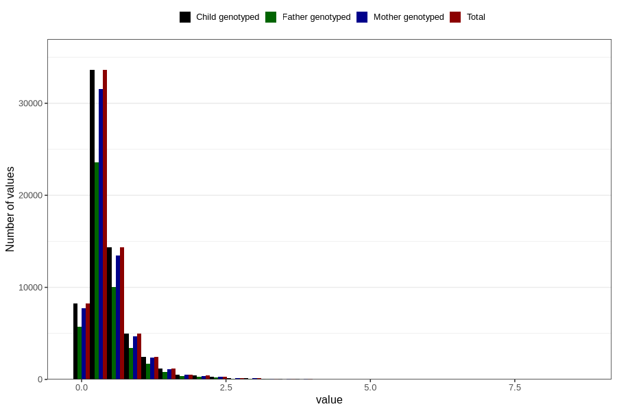

# food_LCn3_g_day
Variable mapping to `f_sum_LCn3` in `Skjema2_beregning_CDW_foody_fatty_acid_and_iodine_v12`.
- Number of values:

| Value | Total | Child genotyped | Mother genotyped | Father genotyped |
| ----- | ----- | --------------- | ---------------- | ---------------- |
| Missing | 14283 | 14283 | 13548 | 6691 |
| Non-missing | 66523 | 66523 | 62476 | 46472 |
| 25th percentile | 0.222 | 0.222 | 0.2219 | 0.2228 |
| 50th percentile | 0.3557 | 0.3557 | 0.3556 | 0.3562 |
| 75th percentile | 0.5671 | 0.5671 | 0.5663 | 0.562925 |
| Mean | 0.475880414292801 | 0.475880414292801 | 0.475493661566041 | 0.471845887846445 |
| Standard deviation | 0.442058089401536 | 0.442058089401536 | 0.441158621429735 | 0.433272004423526 |
| N | 66523 | 66523 | 62476 | 46472 |

