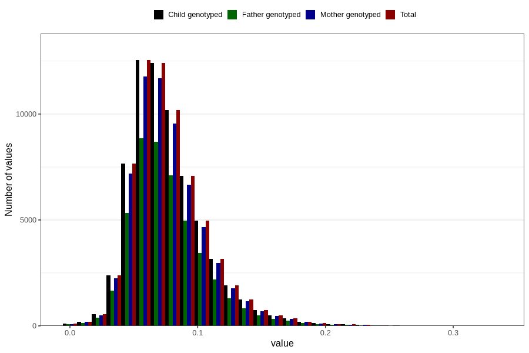

# food_aa_g_day
Variable mapping to `f_aa` in `Skjema2_beregning_CDW_foody_fatty_acid_and_iodine_v12`.
- Number of values:

| Value | Total | Child genotyped | Mother genotyped | Father genotyped |
| ----- | ----- | --------------- | ---------------- | ---------------- |
| Missing | 14283 | 14283 | 13548 | 6691 |
| Non-missing | 66523 | 66523 | 62476 | 46472 |
| 25th percentile | 0.05705 | 0.05705 | 0.0571 | 0.057 |
| 50th percentile | 0.0721 | 0.0721 | 0.0721 | 0.072 |
| 75th percentile | 0.0919 | 0.0919 | 0.0919 | 0.0916 |
| Mean | 0.0773399530989282 | 0.0773399530989282 | 0.0773324700685063 | 0.0770786322947151 |
| Standard deviation | 0.0297309883085746 | 0.0297309883085746 | 0.0296713043457839 | 0.0293630776497051 |
| N | 66523 | 66523 | 62476 | 46472 |

