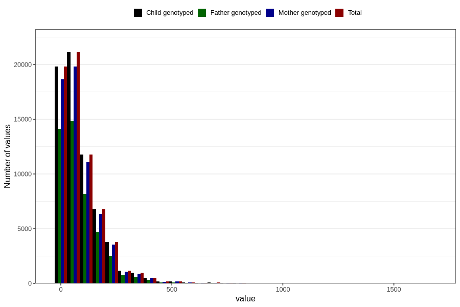

# food_caffeine_total
Variable mapping to `f_caff_tot` in `Skjema2_beregning_CDW_caffeine_food_and_supplements_v12`.
- Number of values:

| Value | Total | Child genotyped | Mother genotyped | Father genotyped |
| ----- | ----- | --------------- | ---------------- | ---------------- |
| Missing | 14283 | 14283 | 13548 | 6691 |
| Non-missing | 66523 | 66523 | 62476 | 46472 |
| 25th percentile | 23.28585 | 23.28585 | 23.281125 | 22.861375 |
| 50th percentile | 59.2764 | 59.2764 | 59.1531 | 57.83045 |
| 75th percentile | 123.54295 | 123.54295 | 123.4276 | 121.081575 |
| Mean | 89.5395647821054 | 89.5395647821054 | 89.3586386196299 | 87.2056124203822 |
| Standard deviation | 94.1382668843753 | 94.1382668843753 | 93.8427225431457 | 90.7046079174661 |
| N | 66523 | 66523 | 62476 | 46472 |

