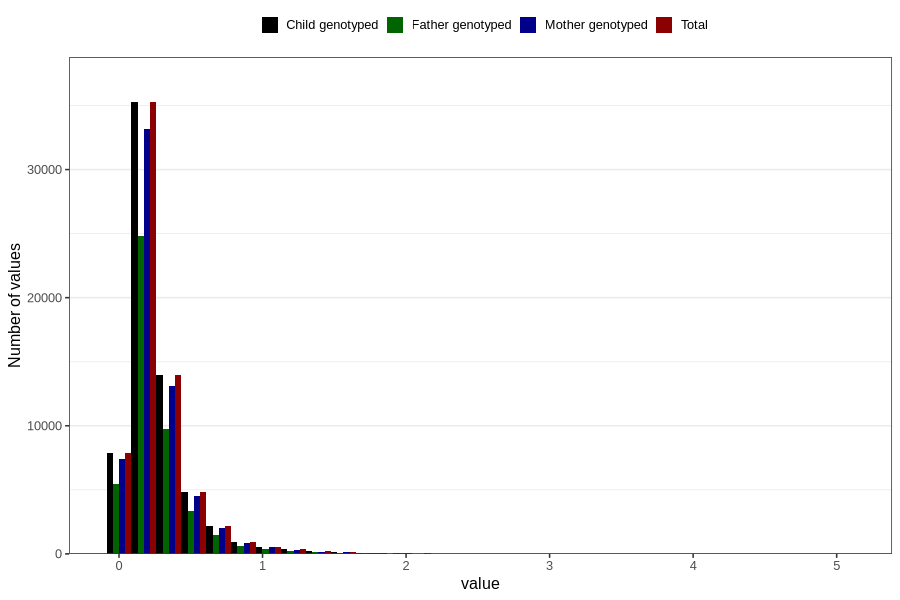

# food_dha_g_day
Variable mapping to `f_dha` in `Skjema2_beregning_CDW_foody_fatty_acid_and_iodine_v12`.
- Number of values:

| Value | Total | Child genotyped | Mother genotyped | Father genotyped |
| ----- | ----- | --------------- | ---------------- | ---------------- |
| Missing | 14283 | 14283 | 13548 | 6691 |
| Non-missing | 66523 | 66523 | 62476 | 46472 |
| 25th percentile | 0.1289 | 0.1289 | 0.1289 | 0.1293 |
| 50th percentile | 0.2025 | 0.2025 | 0.2024 | 0.2025 |
| 75th percentile | 0.3199 | 0.3199 | 0.3195 | 0.317 |
| Mean | 0.267303191377418 | 0.267303191377418 | 0.26708390421922 | 0.264840839645378 |
| Standard deviation | 0.241140031662425 | 0.241140031662425 | 0.240628348751502 | 0.23611902701693 |
| N | 66523 | 66523 | 62476 | 46472 |

