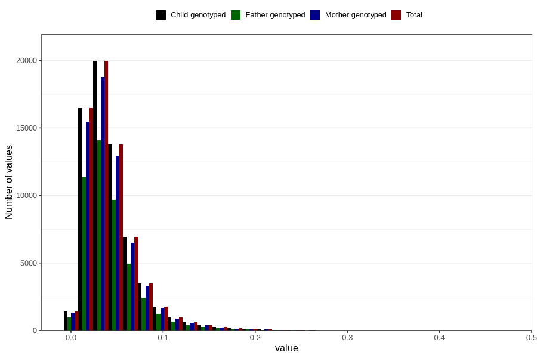

# food_dpa_g_day
Variable mapping to `f_dpa` in `Skjema2_beregning_CDW_foody_fatty_acid_and_iodine_v12`.
- Number of values:

| Value | Total | Child genotyped | Mother genotyped | Father genotyped |
| ----- | ----- | --------------- | ---------------- | ---------------- |
| Missing | 14283 | 14283 | 13548 | 6691 |
| Non-missing | 66523 | 66523 | 62476 | 46472 |
| 25th percentile | 0.0233 | 0.0233 | 0.0233 | 0.0234 |
| 50th percentile | 0.0365 | 0.0365 | 0.0365 | 0.0366 |
| 75th percentile | 0.0539 | 0.0539 | 0.0538 | 0.0537 |
| Mean | 0.043069805931783 | 0.043069805931783 | 0.0430529323260132 | 0.0428859872611465 |
| Standard deviation | 0.0303316162105969 | 0.0303316162105969 | 0.030306560600156 | 0.0297275643745246 |
| N | 66523 | 66523 | 62476 | 46472 |

