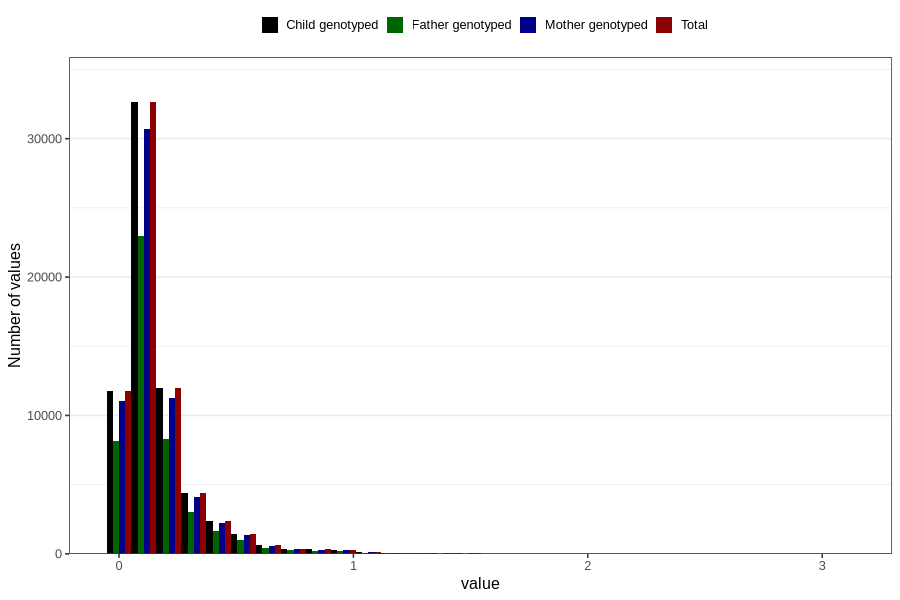

# food_epa_g_day
Variable mapping to `f_epa` in `Skjema2_beregning_CDW_foody_fatty_acid_and_iodine_v12`.
- Number of values:

| Value | Total | Child genotyped | Mother genotyped | Father genotyped |
| ----- | ----- | --------------- | ---------------- | ---------------- |
| Missing | 14283 | 14283 | 13548 | 6691 |
| Non-missing | 66523 | 66523 | 62476 | 46472 |
| 25th percentile | 0.0683 | 0.0683 | 0.0683 | 0.0686 |
| 50th percentile | 0.1159 | 0.1159 | 0.1159 | 0.116 |
| 75th percentile | 0.194 | 0.194 | 0.1938 | 0.192025 |
| Mean | 0.1655074169836 | 0.1655074169836 | 0.165356825020808 | 0.164119060939921 |
| Standard deviation | 0.174971740743855 | 0.174971740743855 | 0.174580843746152 | 0.17171150012118 |
| N | 66523 | 66523 | 62476 | 46472 |

