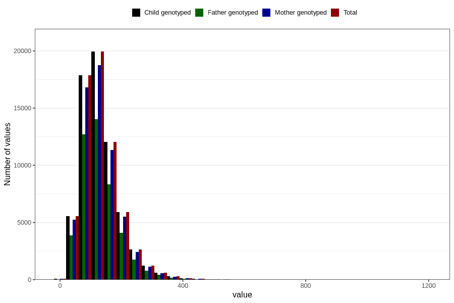

# food_iodine_mcg_day
Variable mapping to `f_jod` in `Skjema2_beregning_CDW_foody_fatty_acid_and_iodine_v12`.
- Number of values:

| Value | Total | Child genotyped | Mother genotyped | Father genotyped |
| ----- | ----- | --------------- | ---------------- | ---------------- |
| Missing | 14283 | 14283 | 13548 | 6691 |
| Non-missing | 66523 | 66523 | 62476 | 46472 |
| 25th percentile | 88.5316 | 88.5316 | 88.510075 | 88.17075 |
| 50th percentile | 121.2502 | 121.2502 | 121.26495 | 120.40725 |
| 75th percentile | 161.6796 | 161.6796 | 161.42075 | 160.36585 |
| Mean | 132.395577114682 | 132.395577114682 | 132.260831098342 | 131.165107529265 |
| Standard deviation | 65.7071842668273 | 65.7071842668273 | 65.6135752778399 | 64.2288795089307 |
| N | 66523 | 66523 | 62476 | 46472 |

