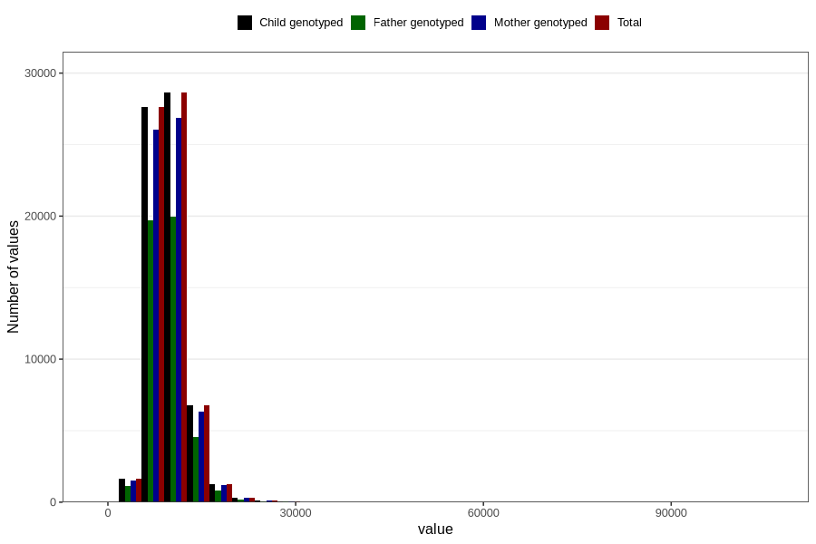

# food_kJ_day
Variable mapping to `f_kJ` in `Skjema2_beregning_CDW_caffeine_food_and_supplements_v12`.
- Number of values:

| Value | Total | Child genotyped | Mother genotyped | Father genotyped |
| ----- | ----- | --------------- | ---------------- | ---------------- |
| Missing | 14283 | 14283 | 13548 | 6691 |
| Non-missing | 66523 | 66523 | 62476 | 46472 |
| 25th percentile | 7890.74 | 7890.74 | 7887.35 | 7857.045 |
| 50th percentile | 9372.27 | 9372.27 | 9364.21 | 9316.435 |
| 75th percentile | 11165.45 | 11165.45 | 11155.1075 | 11078.6875 |
| Mean | 9797.47701847481 | 9797.47701847481 | 9788.85491724822 | 9712.58412054571 |
| Standard deviation | 3061.39678409186 | 3061.39678409186 | 3047.64132881889 | 2933.31497436138 |
| N | 66523 | 66523 | 62476 | 46472 |

