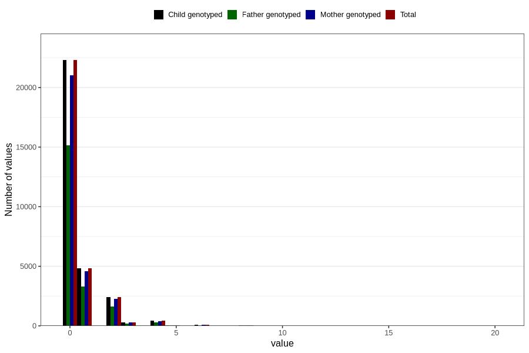

# herbal_tea_during
Variable mapping to `AA1390` in `Skjema1_v12`.
- Number of values:

| Value | Total | Child genotyped | Mother genotyped | Father genotyped |
| ----- | ----- | --------------- | ---------------- | ---------------- |
| Missing | 50291 | 50291 | 47232 | 32500 |
| Non-missing | 30515 | 30515 | 28792 | 20663 |
| 0 | 22293 | 22293 | 21048 | 15130 |
| 1 | 4852 | 4852 | 4570 | 3322 |
| 2 | 2409 | 2409 | 2278 | 1613 |
| 3 | 308 | 308 | 284 | 184 |
| 4 | 429 | 429 | 405 | 288 |
| 5 | 50 | 50 | 46 | 30 |
| 6 | 109 | 109 | 101 | 58 |
| 7 | 9 | 9 | 9 | 4 |
| 8 | 36 | 36 | 33 | 21 |
| 10 | 11 | 11 | 10 | 6 |
| 12 | 7 | 7 | 6 | 6 |
| 16 | 1 | 1 | 1 | 1 |
| 20 | 1 | 1 | 1 | 0 |

